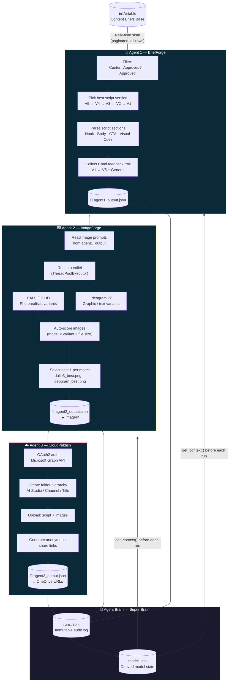
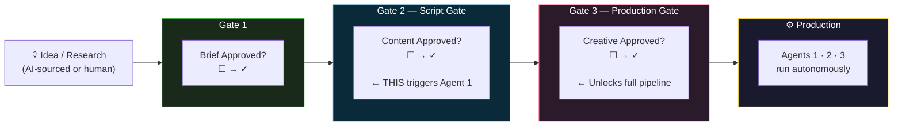
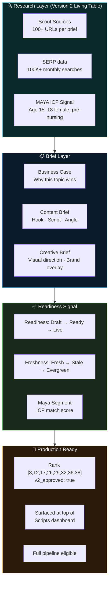
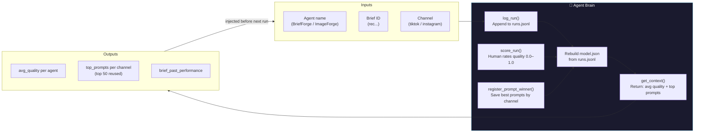
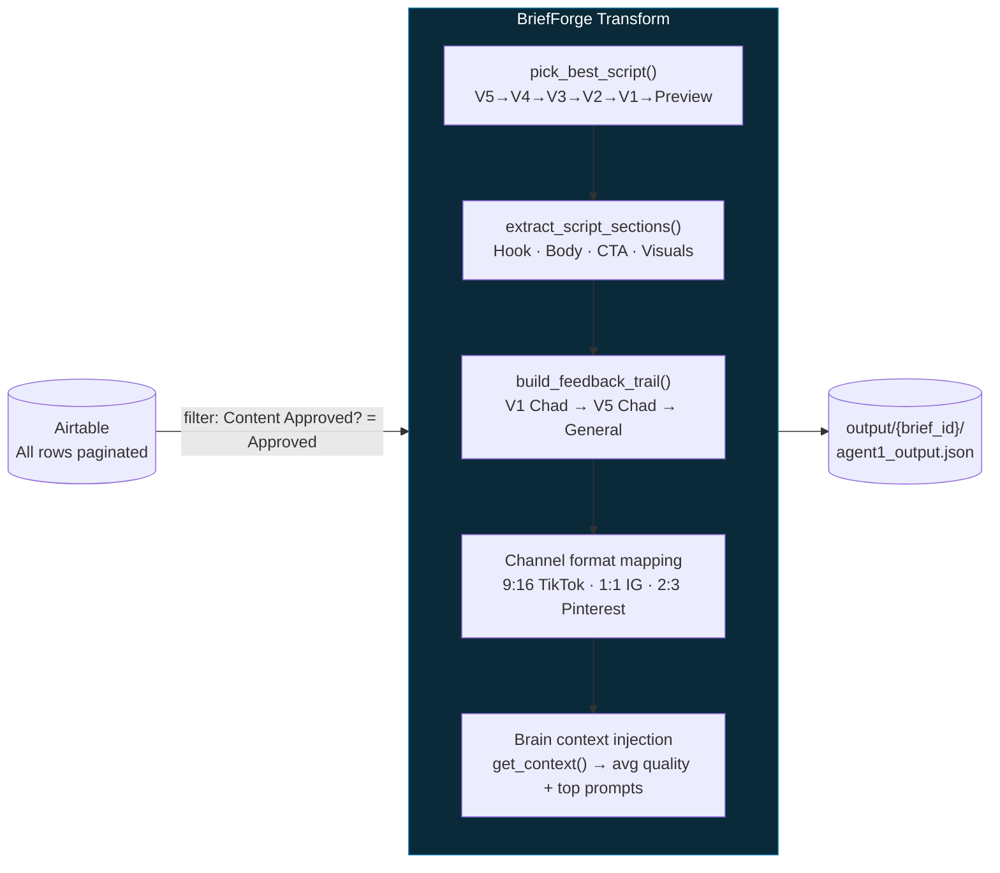
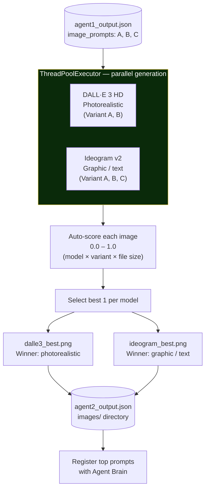
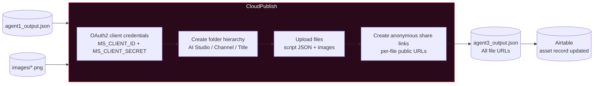
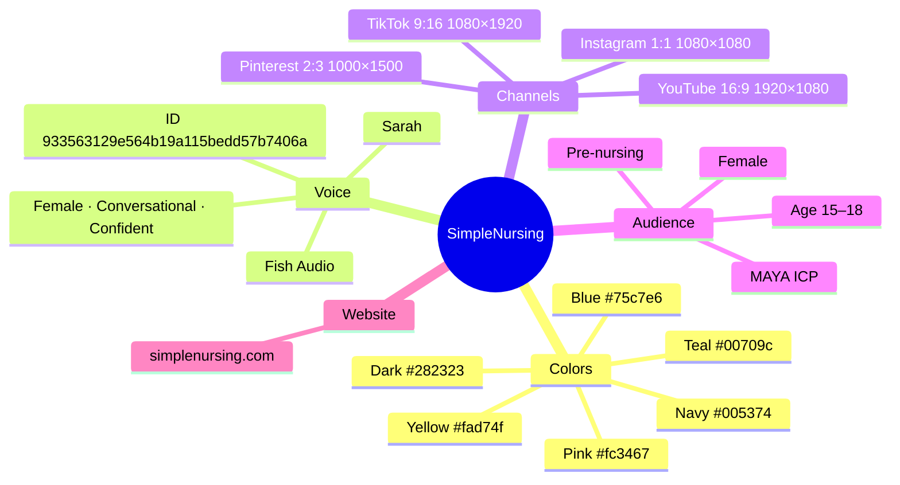

<div align="center">

# EVOLOTION

### Autonomous Content Production System for SimpleNursing

*From research brief to production-ready script — zero human involvement after the approval click*

---

[](https://python.org)
[](https://typescriptlang.org)
[](https://nodejs.org)
[](https://react.dev)
[](https://airtable.com)
[](https://openai.com)
[](https://ideogram.ai)
[](https://graph.microsoft.com)
[](https://fish.audio)

---

**A human approves a brief in Airtable. Three AI agents take it from there.**

</div>

---

## The Pipeline at a Glance



---

## Approval Pipeline — Three Human Gates



> At peak velocity: **9 Content-Approved** briefs feed Agent 1, **5 Creative-Approved** briefs feed the full pipeline.

---

## Version 2 Living Table — Research-to-Production Flow



---

## Agent Brain — Self-Improving Learning Loop



**Storage:**
```
agents/brain/
  runs.jsonl     ← immutable append-only audit log
  model.json     ← derived model state (rebuilt from runs)
```

---

## Quick Start

### Run Agent 1 in 3 steps

```bash
# 1. Clone
git clone https://github.com/samcolibri/aistudio.git
cd aistudio/agents

# 2. Set your Airtable key (only env var needed)
echo "AIRTABLE_API_KEY=patXXXXXXXXXXXXXX" > .env

# 3. Run — auto-installs httpx + python-dotenv on first run
python3 agent.py --list          # show all Content Approved briefs
python3 agent.py --all           # process all → saves JSON per brief
python3 agent.py --brief-id rec0kxOAXZNsJvmwO   # one brief only
python3 agent.py --v2            # Version 2 Living table
python3 agent.py --v2 --all      # process all V2 briefs
```

### Run the full pipeline

```bash
cd aistudio
cp .env.example .env    # fill in API keys (see table below)

python3 agents/run_pipeline.py             # all approved briefs
python3 agents/run_pipeline.py --agent 1   # BriefForge only
python3 agents/run_pipeline.py --agent 2   # ImageForge only
python3 agents/run_pipeline.py --agent 3   # CloudPublish only
python3 agents/run_pipeline.py --brain     # check learned model
```

### Launch the dashboard

```bash
npx tsx src/dashboard/server.ts
# → http://localhost:3004
```

---

## Agent 1 — BriefForge

> **Reads every Airtable row in real-time. Picks the best script. Parses it into production-ready sections.**



**Script section parser — two formats handled:**

| Format | Detection | Hook | Body | CTA |
|--------|-----------|------|------|-----|
| Structured | `**HOOK**` / `**BODY**` / `**CTA**` markers | After `**HOOK**` | After `**BODY**` | After `**CTA**` |
| Freeform | No markers detected | Line 1 | Lines 2 to n-1 | Last line |

Visual directions in `[square brackets]` are always extracted automatically from either format.

**Output JSON:**
```json
{
  "agent": "BriefForge",
  "version": "2.0",
  "brief": {
    "id": "rec0kxOAXZNsJvmwO",
    "rank": 1,
    "title": "Your High School Checklist: 9 Classes...",
    "channel": "TikTok",
    "script_version": "V5",
    "content_approved": "Approved"
  },
  "script": {
    "hook": "take these 9 classes now and nursing school...",
    "body": "class 1: anatomy and physiology...",
    "cta": "follow for more nursing content",
    "visual_directions": ["Show student at desk", "Cut to nursing campus"],
    "word_count": 273,
    "char_count": 1655
  },
  "chad_feedback": [
    { "version": "V4", "text": "tighten the hook..." },
    { "version": "V5", "text": "approved, ship it" }
  ],
  "production_notes": {
    "channel_format": { "ratio": "9:16", "size": "1080x1920" },
    "recommended_voice": "Sarah (Fish Audio 933563129e564b19a115bedd57b7406a)"
  }
}
```

**CLI:**
```bash
python3 agents/agent_1_brief_forge.py --list
python3 agents/agent_1_brief_forge.py --all
python3 agents/agent_1_brief_forge.py --brief-id recXXX
python3 agents/agent_1_brief_forge.py --refresh
```

---

## Agent 2 — ImageForge

> **Reads image prompts from Agent 1. Runs DALL·E 3 HD and Ideogram v2 in parallel. Auto-selects the best image per model.**



**Image prompt variants per channel:**

| Variant | Style | Format | Use case |
|---------|-------|--------|----------|
| A | Photorealistic | 9:16 (TikTok) | Female nursing student, clinical setting |
| B | Bold graphic | 9:16 (TikTok) | Dark bg, teal + yellow, infographic style |
| C | Carousel cover | 1:1 (Instagram only) | Swipe indicator, minimal, on-brand |

**CLI:**
```bash
python3 agents/agent_2_image_forge.py --all
python3 agents/agent_2_image_forge.py --brief-id recXXX
```

**Required env vars:** `OPENAI_API_KEY`, `IDEOGRAM_API_KEY`

---

## Agent 3 — CloudPublish

> **Authenticates with Microsoft Graph API. Creates folder hierarchy in OneDrive/SharePoint. Uploads all assets. Returns public share links.**



**Folder structure created in OneDrive:**
```
AI Studio/
  TikTok/
    Your High School Checklist/
      agent1_output.json
      dalle3_A.png
      ideogram_B.png
```

**CLI:**
```bash
python3 agents/agent_3_cloud_publish.py --all
python3 agents/agent_3_cloud_publish.py --brief-id recXXX
```

**Required env vars:** `MS_CLIENT_ID`, `MS_CLIENT_SECRET`, `MS_TENANT_ID`  
**Optional:** `MS_SHAREPOINT_SITE` · `MS_DRIVE_FOLDER` (default: `AI Studio`)

---

## MAYA — Target Audience

Every piece of content this system produces is engineered for one person:

```
┌────────────────────────────────────────────────────────────────┐
│                         MAYA ICP                               │
├────────────────────────────────────────────────────────────────┤
│  Age:        15–18                                             │
│  Gender:     Female                                            │
│  Stage:      Pre-nursing consideration                         │
│  Platform:   TikTok primary · Instagram secondary              │
│  Trigger:    "Can I actually get into nursing school?"         │
│  Pain:       Confused about prerequisites, scared of failure   │
│  Win:        Clear, confident, specific answer in 30 seconds   │
├────────────────────────────────────────────────────────────────┤
│  Content that works:                                           │
│  ✓ Checklist formats ("9 classes you need to take NOW")        │
│  ✓ Quiz formats ("Are you cut out for nursing school?")        │
│  ✓ Myth-busting ("You do NOT need all A's")                    │
│  ✓ Confident female voice (Sarah, Fish Audio)                  │
│  ✓ Clinical visual setting — not a classroom                   │
└────────────────────────────────────────────────────────────────┘
```

All agents receive this ICP context at runtime via the brand brain.

---

## SimpleNursing Brand System



---

## Dashboard — localhost:3004

The live production command center. Built as a single-file React SPA served by Node.js — no build step.

```
┌──────────────────────────────────────────────────────────────────┐
│  EVOLOTION DASHBOARD            localhost:3004                   │
├────────┬─────────────────────────────────────────────────────────┤
│        │                                                         │
│  📋    │  LEFT PANEL              RIGHT PANEL (reader)           │
│Scripts │  ──────────────          ──────────────────             │
│        │  🟢 READY TO PRODUCE     Brief: #8 — Title...          │
│  🔬    │  ├─ Rank #8  ✓           Hook: "take these..."         │
│ Agent1 │  ├─ Rank #12 ✓                                         │
│        │  ├─ Rank #17 ✓           📜 Creative Brief             │
│  🖼️    │  └─ Rank #38 ✓           (purple box, full text)       │
│ Images │                                                         │
│        │  📁 TABLE 1              🎣 Script                      │
│  ⚙️    │  ├─ Rank #1              Hook · Body · CTA             │
│Settings│  ├─ Rank #3              Visual cues                   │
│        │  └─ Rank #7              Word count · Char count       │
│        │                                                         │
│        │                          💬 Chad Feedback               │
│        │                          V1 → V5 → General             │
│        │                                                         │
│        │                          🔍 Scout Sources               │
│        │                          (collapsible)                  │
└────────┴─────────────────────────────────────────────────────────┘
```

**Key features:**
- V2 Approved briefs (ranks 8, 12, 17, 26, 29, 32, 36, 38) surfaced first in green "Ready to Produce" section
- Live Airtable refresh via SSE streaming (`/api/agent1-refresh`)
- Full script reader: hook, body, CTA, visual directions, feedback trail
- Creative Brief visible in purple box when present
- Scout sources collapsible

---

## Hardcoded Constants

All constants are locked. No configuration overrides allowed.

| Constant | Value | What it locks |
|----------|-------|---------------|
| `AIRTABLE_BASE_ID` | `appLFh438nLooz6u7` | SimpleNursing content briefs base |
| `AIRTABLE_TABLE_ID` | `tbl5P3J8agdY4gNtT` | Content Briefs (Live) table |
| `TABLE2_ID` | `tblrwTcoT7YNZhNA6` | Version 2 (Living) table |
| `APPROVAL_FIELD` | `Content Approved?` | Approval gate field |
| `APPROVAL_VALUE` | `Approved` | Required value to process |
| Script priority | V5 → V4 → V3 → V2 → V1 → Content Preview | Highest version always wins |
| Voice | Sarah · Fish Audio `933563129e564b19a115bedd57b7406a` | Locked narrator |
| Brand teal | `#00709c` | SimpleNursing primary |
| Brand yellow | `#fad74f` | SimpleNursing accent |
| Brand pink | `#fc3467` | SimpleNursing highlight |

---

## Airtable Schema

### Table 1 — Content Briefs (Live)

| Field | Agent | Role |
|-------|-------|------|
| `Content Approved?` | Agent 1 | **Primary gate** — must be `Approved` |
| `Creative Approved?` | Agent 2/3 | Full pipeline gate |
| `Rank` | All | Sort order |
| `Title` | All | Brief title |
| `Hook` | Agent 1 | Opening hook line |
| `Channel` | All | TikTok / Instagram / Pinterest / YouTube |
| `V5 Content` → `V1 Content` | Agent 1 | Script versions (V5 preferred) |
| `Content Preview` | Agent 1 | Pre-versioned fallback |
| `V5 Chad Feedback` → `V1 Chad Feedback` | Agent 1 | Feedback trail |
| `Feedback` | Agent 1 | General notes |
| `Score` | Agent 1 | Brief quality score |
| `Evidence Strength` | Agent 1 | Content credibility signal |

### Table 2 — Version 2 (Living)

| Field | Agent | Role |
|-------|-------|------|
| `Content Brief` | Agent 1 | Full research brief |
| `Creative Brief` | Agent 1 | Visual + production direction |
| `Scout Sources` | Agent 1 | 100+ research URLs |
| `Maya Segment` | Agent 1 | ICP match segment |
| `Business Case` | Agent 1 | Why this topic wins |
| `Readiness` | Agent 1 | Draft / Ready / Live |
| `Freshness` | Agent 1 | Fresh / Stale / Evergreen |

---

## API Keys

| Key | Agent | Where to get | Cost |
|-----|-------|--------------|------|
| `AIRTABLE_API_KEY` | 1 | airtable.com/create/tokens | Free |
| `OPENAI_API_KEY` | 2 | platform.openai.com/api-keys | Pay-per-use |
| `IDEOGRAM_API_KEY` | 2 | ideogram.ai/api | Pay-per-use |
| `MS_CLIENT_ID` | 3 | Azure portal → App registrations | Free |
| `MS_CLIENT_SECRET` | 3 | Azure portal → App registrations | Free |
| `MS_TENANT_ID` | 3 | Azure portal → Overview | Free |
| `MS_SHAREPOINT_SITE` | 3 | Optional (e.g. `colibrigroup.sharepoint.com`) | — |
| `MS_DRIVE_FOLDER` | 3 | Optional (default: `AI Studio`) | — |

**Minimum to run Agent 1:** `AIRTABLE_API_KEY` only.

---

## Output Structure

```
agents/
  output/
    {brief_id}/
      agent1_output.json    ← script + brand + feedback trail
      agent2_output.json    ← image selection + scores
      agent3_output.json    ← cloud URLs + share links
      images/
        dalle3_A.png        ← photorealistic winner
        dalle3_B.png
        ideogram_A.png      ← graphic/text winner
        ideogram_B.png
  brain/
    runs.jsonl              ← every run, immutable
    model.json              ← learned model state
```

> `agents/output/` is gitignored — never committed to source control.

---

## Repo Structure

```
aistudio/
├── agents/
│   ├── agent.py                    ← self-contained Agent 1 (clone + run)
│   ├── agent_1_brief_forge.py      ← full pipeline Agent 1
│   ├── agent_2_image_forge.py      ← full pipeline Agent 2
│   ├── agent_3_cloud_publish.py    ← full pipeline Agent 3
│   ├── agent_brain.py              ← Super Brain (learning loop)
│   ├── run_pipeline.py             ← orchestrator (runs all 3)
│   ├── config.py                   ← all hardcoded constants
│   ├── BRIEFFORGE.md               ← Agent 1 standalone docs
│   └── agent.md                    ← full system docs
│
├── src/
│   ├── dashboard/
│   │   └── server.ts               ← dashboard server + full React SPA
│   ├── scripts/                    ← production agents (voice, video, image)
│   ├── client/                     ← typed API clients
│   └── types/                      ← TypeScript types
│
├── remotion/                       ← Remotion video editor
├── output/                         ← produced assets (gitignored)
├── .env.example                    ← copy to .env, fill keys
└── README.md
```

---

## Azure App Setup (Agent 3)

To upload to OneDrive/SharePoint:

1. Go to `portal.azure.com` → Azure Active Directory → App registrations → New registration
2. Add API permissions: `Files.ReadWrite.All` *(application permission, not delegated)*
3. Grant admin consent
4. Create client secret → Certificates & secrets
5. Copy values to `.env`:

```bash
MS_CLIENT_ID=<Application (client) ID>
MS_TENANT_ID=<Directory (tenant) ID>
MS_CLIENT_SECRET=<secret value>
```

---

<div align="center">

**Built by [Colibri Group](https://colibrigroup.com) for SimpleNursing**

*Internal tool — not for redistribution*

</div>
